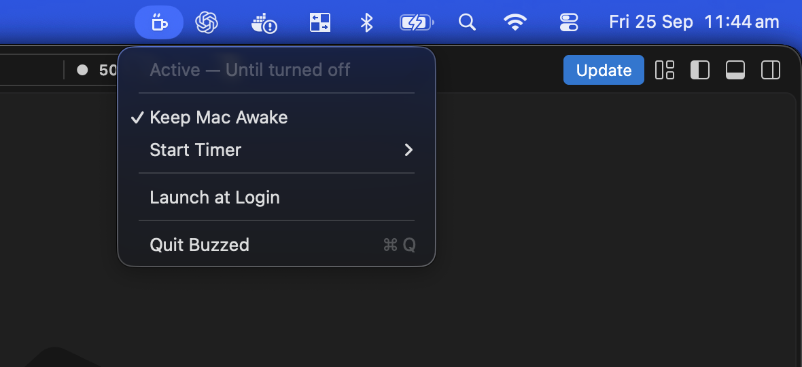

# Buzzed ☕

Buzzed is a tiny macOS menu bar app that keeps your Mac awake while unattended work finishes.

## Why Buzzed exists

Coding agents, builds, test suites, downloads, and other long-running tasks often need more time than you want to spend sitting in front of your laptop. If you walk away, macOS may go to sleep and pause that work.

You can prevent this from Terminal with `caffeinate`, but remembering the command—and returning later to stop it—is inconvenient. Buzzed puts the same control behind a coffee cup in the menu bar. Turn it on indefinitely or choose a timer, then walk away knowing the Mac will stay awake until you tell it to stop.

Buzzed is intended for personal use on Apple-silicon Macs.



_Buzzed stays out of the way in the menu bar while showing its current status and essential controls._

## What it does

- Lives quietly in the macOS menu bar with no Dock icon.
- Prevents both the display and the Mac itself from going to sleep.
- Supports indefinite sessions and 15-minute, 30-minute, 1-hour, or 2-hour timers.
- Supports custom timers from 1 minute to 24 hours.
- Shows a live countdown inside the menu.
- Sends a notification when a timer finishes.
- Can optionally launch when you log in.
- Starts inactive every time it opens, so it never keeps the Mac awake unexpectedly.

## Install the packaged app

The easiest way to install Buzzed is with the DMG:

1. Open `Buzzed.dmg`.
2. Drag **Buzzed** onto the **Applications** folder in the installer window.
3. Wait for the copy to finish, then eject the **Buzzed** disk image from Finder.
4. Open Buzzed from your Applications folder.
5. Look for the coffee cup on the right side of the macOS menu bar.

If you use the ZIP instead, unzip it and drag **Buzzed.app** into your Applications folder manually.

The app is intentionally unsigned and unnotarized. If macOS blocks the first launch:

1. Open **System Settings → Privacy & Security**.
2. Scroll to the security message about Buzzed.
3. Click **Open Anyway**, then confirm that you want to open it.

Only do this for a copy of Buzzed that you built yourself or received from someone you trust.

## Use Buzzed

Click the coffee cup in the menu bar to open the menu.

### Keep the Mac awake until you turn it off

1. Enable **Keep Mac Awake**.
2. The cup changes to the active, steaming version.
3. When the work is finished, open the menu and disable **Keep Mac Awake**.

### Start a timer

1. Open **Start Timer**.
2. Choose **15 Minutes**, **30 Minutes**, **1 Hour**, or **2 Hours**.
3. The status line displays the remaining time.
4. Buzzed turns itself off and sends a notification when the timer reaches zero.

Starting another timer replaces the current timer. Disabling **Keep Mac Awake** cancels any active timer immediately.

### Set a custom timer

1. Choose **Start Timer → Custom…**.
2. Enter the number of hours and minutes.
3. Click **Start Timer**.

Custom durations can be anywhere from 1 minute to 24 hours. Cancelling the window leaves the current Buzzed session unchanged.

### Launch Buzzed when you sign in

Enable **Launch at Login** from the menu. Because this personal build is not notarized, macOS may require approval under **System Settings → General → Login Items & Extensions**.

Buzzed still starts inactive after a login launch. You must explicitly enable it or start a timer.

### Quit Buzzed

Choose **Quit Buzzed** from the menu. Quitting immediately releases the sleep-prevention request, even if a timer was running.

## Important limitations

- Buzzed prevents idle system sleep and display sleep, but it cannot keep a MacBook awake after its lid is closed.
- Keeping the display and computer awake consumes more battery. Remember to turn Buzzed off when it is no longer needed.
- Buzzed currently supports Apple-silicon macOS only. There is no Intel, Windows, or Linux build.
- Timers are kept only in memory. Quitting or restarting Buzzed cancels them.

## Build from source

You need:

- An Apple-silicon Mac
- Node.js and npm
- The Xcode Command Line Tools normally used by Electron tooling

From the project folder, install dependencies and start the development build:

```sh
npm install
npm start
```

The development build also lives in the menu bar and starts inactive. Stop it from the Buzzed menu or return to Terminal and press `Control-C`.

## Test and package

Run the automated tests and TypeScript checks:

```sh
npm test
npm run typecheck
```

Create the Apple-silicon app, drag-to-Applications DMG, and ZIP archive:

```sh
npm run make
```

The finished files are written to:

- App: `out/Buzzed-darwin-arm64/Buzzed.app`
- DMG: `out/make/Buzzed.dmg`
- ZIP: `out/make/zip/darwin/arm64/Buzzed-darwin-arm64-1.0.0.zip`

These artifacts are for local, personal use and are not signed, notarized, or prepared for commercial distribution.

## Troubleshooting

### The coffee cup does not appear

- Check whether Buzzed is already running in Activity Monitor.
- Quit any existing Buzzed process, then open the app again.
- If the menu bar is crowded, macOS may hide some menu bar items until space becomes available.

### Launch at Login does not work

- Move Buzzed into `/Applications` before enabling the option.
- Open **System Settings → General → Login Items & Extensions** and approve or add Buzzed manually.
- Launch-at-login support is best-effort for this unsigned personal build.

### Timer notifications do not appear

Open **System Settings → Notifications → Buzzed** and allow notifications. Timer expiration still turns Buzzed off even when notifications are disabled.

### Check whether Buzzed is preventing sleep

While Buzzed is active, run:

```sh
pmset -g assertions
```

The output should show active assertions preventing display sleep and idle system sleep. They disappear when Buzzed is turned off or quit.

## How it works

Buzzed safely starts macOS's built-in command:

```sh
/usr/bin/caffeinate -d -i -w <buzzed-process-id>
```

The `-d` and `-i` options prevent display sleep and idle system sleep. Binding the command to Buzzed's process ID ensures macOS releases those assertions if Buzzed exits or crashes.
